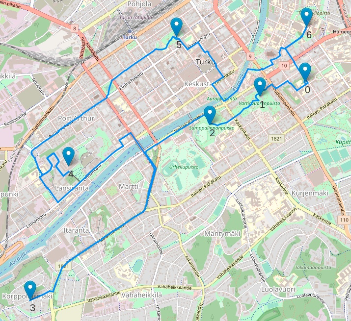
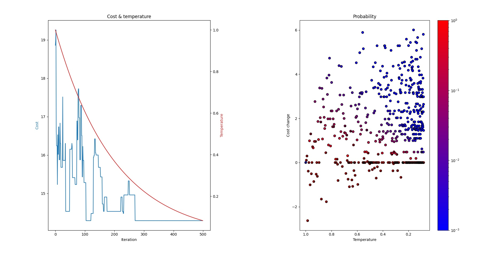

# Conquering Seven Hills

Finding optimal (shortest) walking path for seven hills in Turku.

https://omyllymaki.medium.com/conquering-seven-hills-route-optimization-with-sa-d96ace682e2c

# Task

The task is to find shortest walking path for seven hills in Turku. The walk should start and end to same place, and every hill should be visited once.

# Technologies

- Visualization: Folium
- Calculating walking distances: networkx, osmnx

# Results

**Optimal route, total distance 14.29 km**

**Simulated annealing solution**

