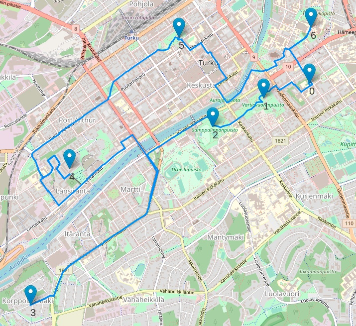

# Conquering Seven Hills

Finding optimal walking path for seven hills in Turku.

# Task

The task is to find optimal walking path for seven hills in Turku. The walk should start and end to same place, and every hill should be visited once.

# Technologies

- Visualization: Folium
- Calculating walking distances: networkx, osmnx

# Results

Optimal path, as suggested by simulated annealing method, with Kerttulinmäki as start and end point:

Kerttulinmäki -> Vartiovuori -> Samppalinnanmäki -> Korppolaismäki -> Kakolanmäki -> Puolalanmäki -> Yliopistonmäki -> Kerttulinmäki

Total distance: 14.29 km

